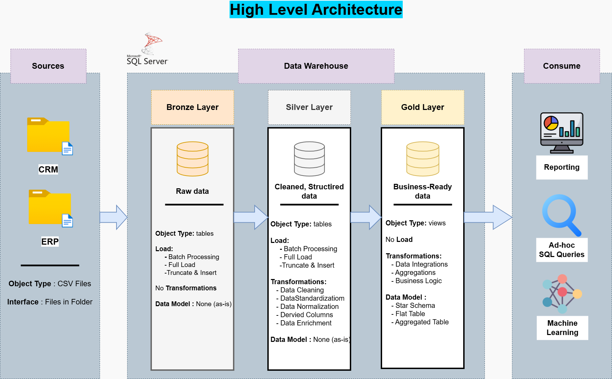
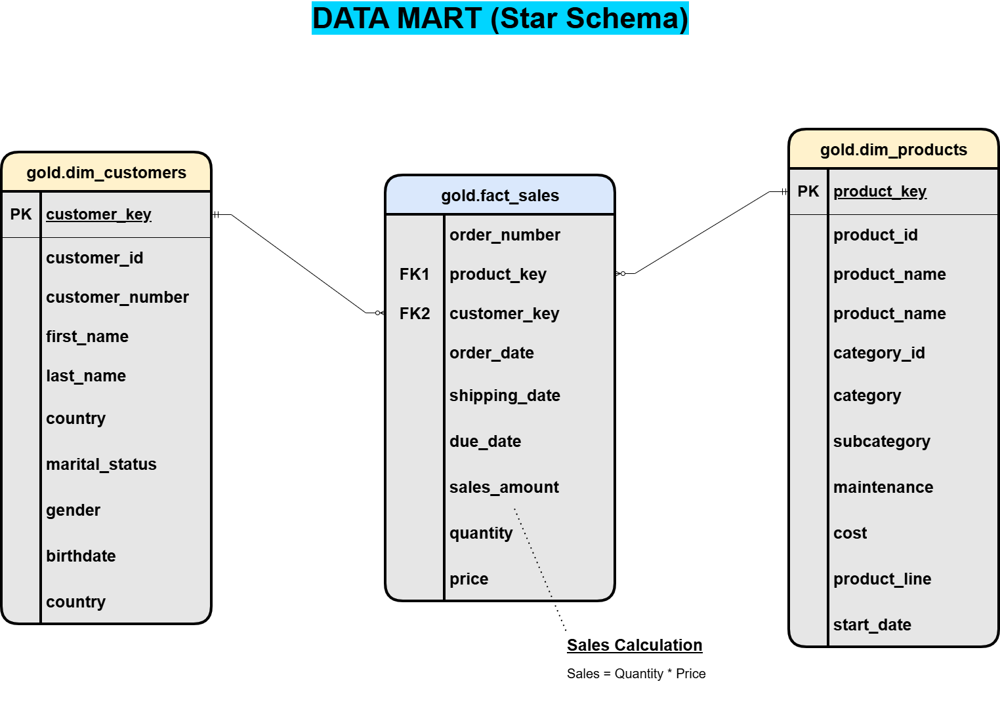

# 📊 Project 1: SQL Data Warehouse (Medallion Architecture)

> **Building a Production-Grade Data Warehouse with Layered ETL Pipelines**

---

# 🎯 Project Overview

This project implements a **Medallion Architecture** data warehouse pattern using SQL Server. It demonstrates enterprise-level ETL pipelines, layered transformations, and analytics-ready dimensional modeling.

The warehouse follows a structured three-layer architecture:

- 🥉 Bronze → Raw ingestion
- 🥈 Silver → Cleansed & transformed data
- 🥇 Gold → Business-ready analytical models

---

# 🏗️ Architecture: Visual Overview

## 📐 Architecture Diagram



The Medallion Architecture consists of three layers:

- 🥉 Bronze → Raw Data
- 🥈 Silver → Cleansed Data
- 🥇 Gold → Analytics Models

---

## 🔗 Integration Model


Shows how CRM and ERP systems are integrated into a unified warehouse.

---

## ⭐ Data Model (Star Schema)



### Core Components

### Fact Table
- `gold.fact_sales`

### Dimension Tables
- `gold.dim_customers`
- `gold.dim_products`
- `gold.dim_dates`

The star schema improves analytical query performance and reporting efficiency.

---

## 🔄 Data Flow Diagram


Illustrates the ETL pipeline from ingestion to analytics-ready reporting models.

---

# 🥉 Bronze Layer — Raw Ingestion

## Purpose
Store raw source-system data exactly as received.

## Responsibilities
- Raw CSV ingestion
- Audit preservation
- Data lineage tracking
- Source fidelity

## Scripts

- 📄 [ddl_bronze.sql](../scripts/01_data_warehouse/bronze/ddl_bronze.sql)
- 📄 [proc_load_bronze.sql](../scripts/01_data_warehouse/bronze/proc_load_bronze.sql)

## Source Tables
- `bronze.cust_info`
- `bronze.prd_info`
- `bronze.sales_details`

---

# 🥈 Silver Layer — Cleansing & Transformation

## Purpose
Apply transformations, validations, and business rules.

## Responsibilities
- Null handling
- Deduplication
- Standardization
- Type conversion
- Validation

## Scripts

- 📄 [ddl_silver.sql](../scripts/01_data_warehouse/silver/ddl_silver.sql)
- 📄 [proc_load_silver.sql](../scripts/01_data_warehouse/silver/proc_load_silver.sql)

## Quality Rules

- Customer key cannot be NULL
- Sales amount > 0
- No duplicate records
- Valid order dates

---

# 🥇 Gold Layer — Analytics Models

## Purpose
Deliver business-ready dimensional models.

## Responsibilities
- Star schema design
- Fact/dimension modeling
- Reporting optimization
- Business metrics

## Scripts

- 📄 [ddl_gold.sql](../scripts/01_data_warehouse/gold/ddl_gold.sql)

## Core Tables

### Fact Table
- `gold.fact_sales`

### Dimensions
- `gold.dim_customers`
- `gold.dim_products`
- `gold.dim_dates`

---

# 🚀 Setup & Execution

## Step 1 — Initialize Database

```sql
:r ../scripts/01_data_warehouse/init_database.sql
```

---

## Step 2 — Load Bronze Layer

```sql
:r ../scripts/01_data_warehouse/bronze/ddl_bronze.sql
:r ../scripts/01_data_warehouse/bronze/proc_load_bronze.sql
EXEC bronze.load_bronze;
```

---

## Step 3 — Load Silver Layer

```sql
:r ../scripts/01_data_warehouse/silver/ddl_silver.sql
:r ../scripts/01_data_warehouse/silver/proc_load_silver.sql
EXEC silver.load_silver;
```

---

## Step 4 — Create Gold Layer

```sql
:r ../scripts/01_data_warehouse/gold/ddl_gold.sql
```

---

## Step 5 — Run Quality Checks

```sql
:r ../scripts/01_data_warehouse/tests/quality_checks_silver.sql
:r ../scripts/01_data_warehouse/tests/quality_checks_gold.sql
```

---

# 📊 Data Sources

## CRM Source

📁 [source_crm](../datasets/source_crm)

- 📄 [cust_info.csv](../datasets/source_crm/cust_info.csv)
- 📄 [prd_info.csv](../datasets/source_crm/prd_info.csv)
- 📄 [sales_details.csv](../datasets/source_crm/sales_details.csv)

---

## ERP Source

📁 [source_erp](../datasets/source_erp)

- 📄 [CUST_AZ12.csv](../datasets/source_erp/CUST_AZ12.csv)
- 📄 [LOC_A101.csv](../datasets/source_erp/LOC_A101.csv)
- 📄 [PX_CAT_G1V2.csv](../datasets/source_erp/PX_CAT_G1V2.csv)

---

# 🧪 Data Quality Framework

## Quality Check Scripts

- 📄 [quality_checks_silver.sql](../scripts/01_data_warehouse/tests/quality_checks_silver.sql)
- 📄 [quality_checks_gold.sql](../scripts/01_data_warehouse/tests/quality_checks_gold.sql)

---

# 🔗 Related Documentation

- 🖼️ [Architecture Diagram](../docs/dw_architecture.png)
- 🖼️ [Data Model](../docs/data_model.png)
- 🖼️ [Data Flow](../docs/data_flow.png)
- 📄 [Data Catalog](../docs/data_catalog.md)
- 📄 [Naming Conventions](../docs/naming_conventions.md)

---

# 🎓 Credits

This project is inspired by the SQL Master Class created by :contentReference[oaicite:0]{index=0}.

Happy Learning 🚀